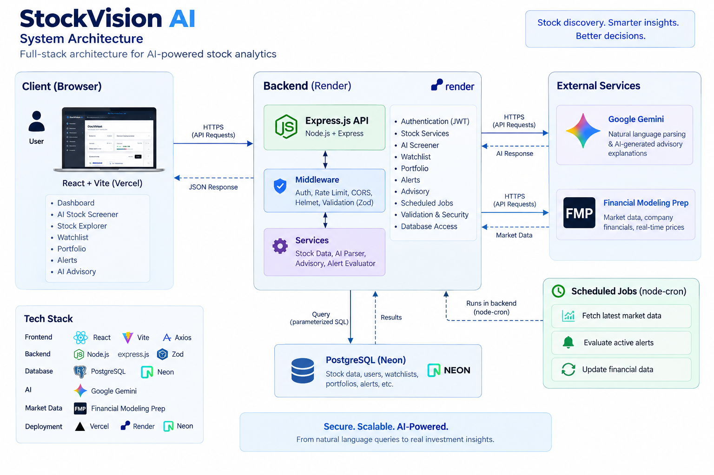
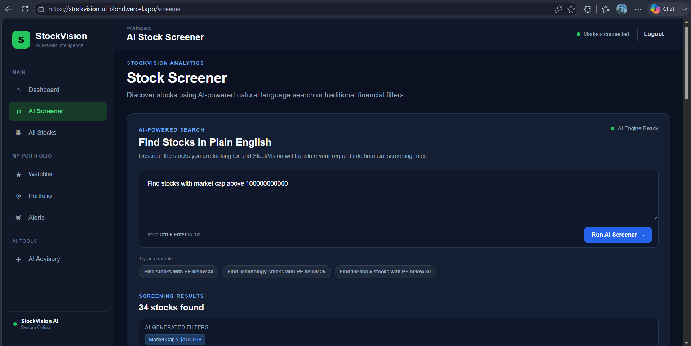
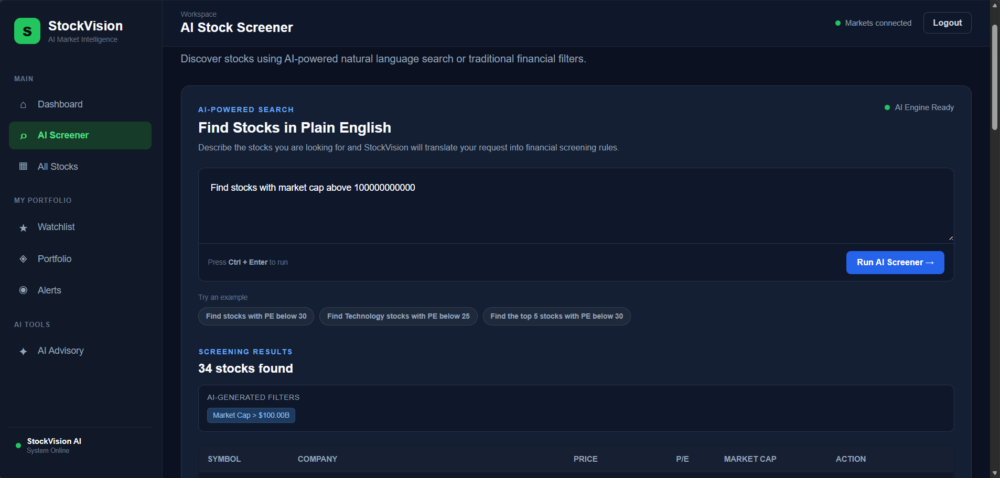
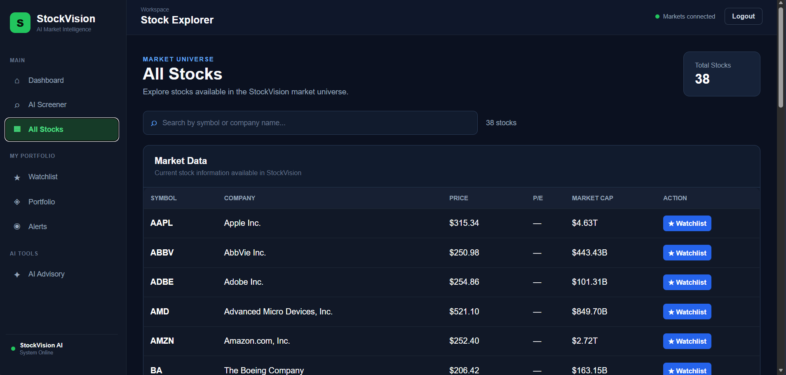
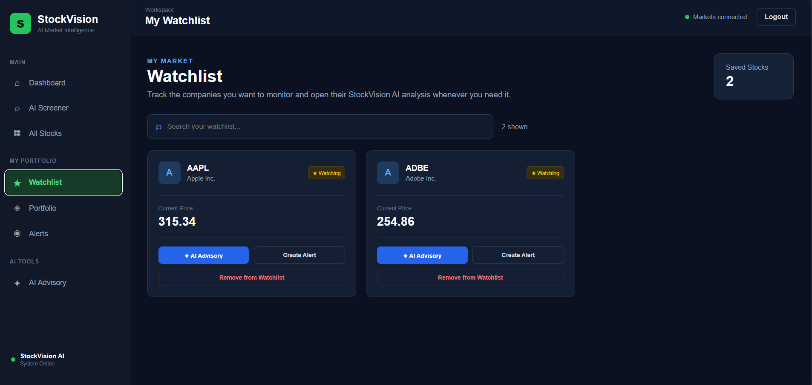
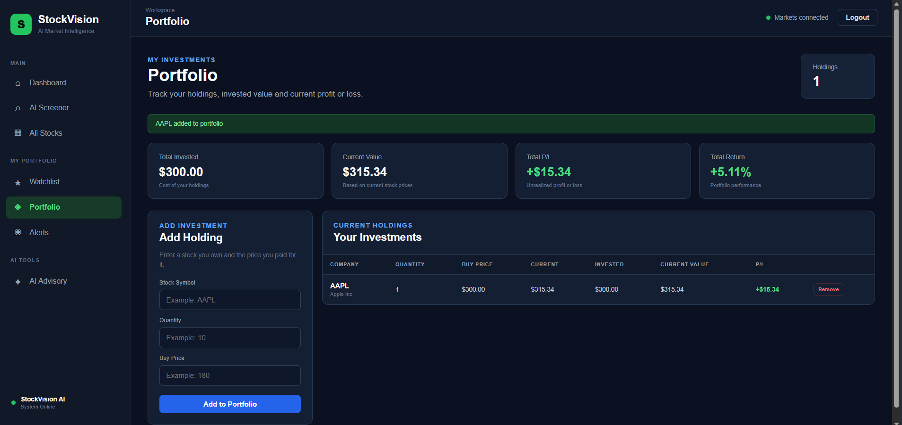
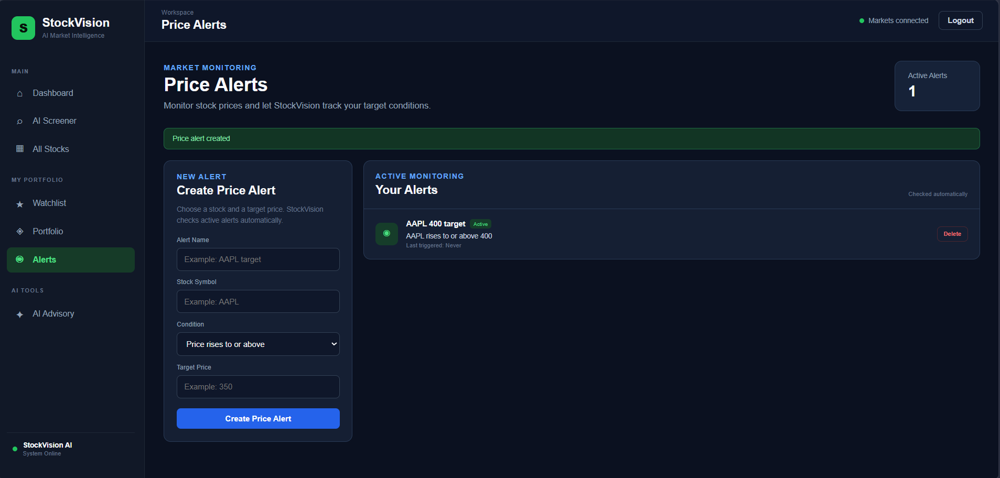
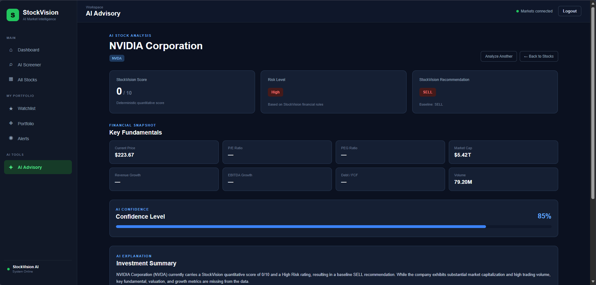

# StockVision AI

A full-stack stock analytics platform that combines natural-language stock screening, portfolio tracking, price alerts, watchlists, and AI-assisted stock analysis.

**Live App:** https://stockvision-ai-blond.vercel.app  
**API Health:** https://stockvision-ai-wo94.onrender.com/health

---

## About the Project

StockVision AI started as a stock screening project and gradually evolved into a complete full-stack web application.

The main idea was to make stock screening easier. Instead of forcing users to build complicated filters manually, StockVision lets them describe what they are looking for in normal English.

For example:

```text
Find stocks with market cap above 100000000000
```

```text
Find stocks with market cap below 500000000000
```

```text
Find the top 5 stocks with PE below 30
```

The backend converts the request into structured rules, validates them, builds a parameterized SQL query, and searches the stock database.

The project also includes authentication, stock exploration, a personal watchlist, portfolio analytics, price alerts, scheduled market-data updates, and an AI-assisted advisory system.

---

## Architecture

The application uses a separated frontend, backend, database, and external-service architecture.



The frontend is built with React and Vite and deployed on Vercel. It communicates with the Express API hosted on Render.

The backend handles authentication, stock screening, portfolio operations, watchlists, alerts, advisory analysis, scheduled jobs, and database access.

PostgreSQL is hosted on Neon, while Financial Modeling Prep provides market data and Google Gemini is used for natural-language rule parsing and advisory explanations.

The lower part of the diagram shows the AI Screener pipeline in more detail. AI output is never executed directly against the database. It first goes through validation and the query compiler before parameterized SQL is executed.

---

## Main Features

### AI Stock Screener

The AI Screener allows users to search for stocks using natural language.

A request such as:

```text
Find stocks with market cap above 100000000000
```

is converted into structured screening rules.

The processing flow is:

```text
Natural-language request
        ↓
Gemini parser
        ↓
Validated screening rules
        ↓
Query compiler
        ↓
Parameterized SQL
        ↓
PostgreSQL
        ↓
Filtered stocks
```

The screener also includes retry handling and a deterministic fallback parser. If Gemini is temporarily unavailable, common screening queries can still be processed instead of failing immediately.

---

### Stock Explorer

Users can browse the stock universe available in StockVision and view information such as:

- Current price
- Market capitalization
- P/E ratio
- PEG ratio
- Revenue growth
- EBITDA growth
- Trading volume
- Sector

Unavailable financial information is shown as missing instead of being replaced with fabricated values.

---

### Watchlist

Logged-in users can create their own watchlist.

Users can:

- Add stocks
- Remove stocks
- Avoid duplicate watchlist entries
- Open advisory analysis directly from the watchlist

---

### Portfolio

The portfolio section allows users to record their holdings using:

- Stock symbol
- Quantity
- Purchase price
- Purchase date

StockVision then calculates useful portfolio information including:

- Total invested value
- Current portfolio value
- Profit or loss
- Percentage return

---

### Price Alerts

Users can create price-based monitoring rules.

For example:

```text
AAPL >= 400
```

Active alerts are evaluated against updated market prices by the backend.

A cooldown mechanism prevents the same alert from being repeatedly triggered within a short period.

---

### AI Advisory

The advisory system provides structured analysis for individual stocks.

It includes:

- StockVision recommendation
- Analysis score
- Risk assessment
- Important financial metrics
- AI-generated explanation

The recommendation itself is produced by deterministic analysis logic.

Gemini is used as an explanation layer so the result is easier to understand. If the AI service is temporarily unavailable, the application can return a deterministic fallback explanation instead of failing the whole advisory request.

---

### Authentication

StockVision supports account-based access with:

- Registration
- Login
- Password hashing
- JWT authentication
- Protected frontend routes
- Authenticated backend endpoints

User-specific features such as portfolio, watchlist, and alerts are protected.

---

### Background Market Jobs

The backend uses scheduled jobs for recurring tasks such as:

- Refreshing market prices
- Updating available stock fundamentals
- Evaluating active alerts

Job locking is used to avoid overlapping refresh operations.

---

## Tech Stack

### Frontend

- React
- Vite
- React Router
- Axios
- CSS

### Backend

- Node.js
- Express.js
- Zod
- JWT
- bcryptjs
- Axios
- node-cron
- Helmet
- Express Rate Limit

### Database

- PostgreSQL
- Neon

### AI

- Google Gemini
- Structured rule generation
- Deterministic fallback parser
- AI-assisted advisory explanations

### Market Data

- Financial Modeling Prep API

### Deployment

- Vercel — frontend
- Render — backend
- Neon — PostgreSQL database
- GitHub — source control

---

## Screenshots

### Dashboard



### AI Screener



### Stock Explorer



### Watchlist



### Portfolio



### Price Alerts



### AI Advisory



---

## Security and Reliability

Several safeguards were added while preparing StockVision for production.

These include:

- Password hashing
- JWT authentication
- Parameterized SQL queries
- Zod validation
- CORS restrictions
- Helmet security headers
- API rate limiting
- Request-body size limits
- Environment-based secrets
- Database connection pooling
- Graceful server shutdown
- Background-job locking
- AI retry handling
- Deterministic AI fallbacks
- Production error handling

API keys, database credentials, and JWT secrets are stored using environment variables and are not committed to the repository.

---

## Project Structure

```text
stockvision-ai/
│
├── backend/
│   ├── src/
│   │   ├── controllers/
│   │   ├── db/
│   │   ├── middleware/
│   │   ├── routes/
│   │   ├── services/
│   │   ├── app.js
│   │   └── server.js
│   │
│   ├── .env.example
│   └── package.json
│
├── frontend/
│   ├── src/
│   │   ├── components/
│   │   ├── context/
│   │   ├── pages/
│   │   ├── services/
│   │   ├── App.jsx
│   │   ├── main.jsx
│   │   └── styles.css
│   │
│   ├── .env.example
│   ├── vercel.json
│   └── package.json
│
├── assets/
│   ├── architecture/
│   │   └── stockvision-system-architecture.png
│   │
│   └── screenshots/
│
└── README.md
```

---

## Running the Project Locally

### 1. Clone the repository

```bash
git clone https://github.com/chndn-coder/stockvision-ai.git
cd stockvision-ai
```

### 2. Backend setup

```bash
cd backend
npm install
```

Create a `.env` file using `backend/.env.example` as a reference.

Example:

```env
PORT=5000
NODE_ENV=development
CLIENT_URL=http://localhost:5173

DB_HOST=localhost
DB_USER=postgres
DB_PASSWORD=your_password
DB_NAME=stockvision
DB_PORT=5432

JWT_SECRET=your_jwt_secret

GEMINI_API_KEY=your_gemini_api_key
FMP_API_KEY=your_fmp_api_key
```

A PostgreSQL connection URL can also be supplied using:

```env
DATABASE_URL=your_postgresql_connection_url
```

Start the backend:

```bash
npm run dev
```

The local API runs on:

```text
http://localhost:5000
```

---

### 3. Frontend setup

Open another terminal:

```bash
cd frontend
npm install
```

Create:

```text
frontend/.env
```

Add:

```env
VITE_API_URL=http://localhost:5000/api
```

Start the frontend:

```bash
npm run dev
```

Vite will normally make the application available at:

```text
http://localhost:5173
```

---

## Environment Variables

Example environment configuration is available in:

```text
backend/.env.example
frontend/.env.example
```

Real `.env` files are ignored by Git.

Never commit API keys, JWT secrets, database passwords, or production connection strings.

---

## API Overview

Some of the main API groups used by StockVision are:

```text
/api/auth
/api/stocks
/api/stocks/screener
/api/stocks/ai-screener
/api/watchlist
/api/portfolio
/api/alerts
/api/advisory
```

The backend also provides a public health endpoint:

```text
GET /health
```

---

## Production Deployment

StockVision is deployed as three separate cloud components.

**Frontend**

```text
React + Vite
      ↓
    Vercel
```

**Backend**

```text
Node.js + Express
        ↓
      Render
```

**Database**

```text
PostgreSQL
    ↓
   Neon
```

The production frontend communicates with the backend through HTTPS, while CORS is restricted to the configured frontend origin.

The Render backend connects to Neon for persistent PostgreSQL storage and communicates with the Gemini and market-data APIs when required.

---

## Current Limitations

StockVision is a personal analytics and engineering project rather than a brokerage platform.

Market-data coverage depends on the external API plan, so some stocks or financial metrics may not always be available.

The free backend hosting environment can also take some time to wake up after a period of inactivity.

AI services can occasionally be unavailable or rate-limited. For important StockVision workflows, retry and fallback behavior has been added so temporary AI failures do not necessarily make the whole feature unavailable.

StockVision does not execute trades or connect to real brokerage accounts.

---

## What I Learned

Building StockVision involved much more than creating the initial stock screener.

While developing and deploying the project, I worked with:

- React application architecture
- REST API development with Express
- PostgreSQL schema design and queries
- JWT-based authentication
- Dynamic but parameterized SQL generation
- Natural-language-to-structured-data workflows
- External AI and market-data APIs
- Handling API failures and rate limits
- Background jobs
- Production environment configuration
- Cloud PostgreSQL deployment
- Frontend and backend deployment
- CORS and API security
- Dependency security updates
- Debugging differences between local and production environments

One of the most useful lessons from the project was that adding AI is only one part of building an AI-powered application. Validation, fallbacks, security, data quality, and failure handling are just as important when the application is running for real users.

---

## Future Improvements

There are still several directions I would like to explore:

- Historical stock-price charts
- Larger stock coverage
- More detailed portfolio analytics
- Email or push notifications for alerts
- Company news integration
- Sentiment analysis
- Additional financial ratios
- Automated backend and frontend tests
- CI/CD quality checks
- Improved market-data coverage

---

## Disclaimer

StockVision AI is built for educational and analytical purposes.

Information or recommendations displayed by the application should not be treated as financial advice. Users should perform their own research before making investment decisions.

---

## Author

**Chandan Kumar**

Computer Science Engineer interested in full-stack development, backend engineering, and AI-powered applications.

GitHub: https://github.com/chndn-coder